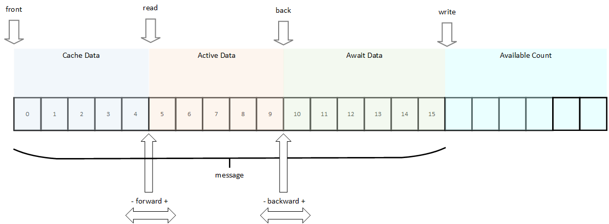

# SlidingWindow

SlidingWindow is a simply sliding window implement for Embedded Systems. Users just need to add files `/sliding_window/include/sliding_window.h `and `/sliding_window/src/sliding_window.c` into their project.

I use the SlidingWindow in 《GB/T27930-2023》.



# API

```c
/**
 * @brief Initialize sliding window
 *
 * @param window: sliding window handle
 * @param buffer: buffer to store elements
 * @param buffer_size: buffer size
 * @param element_size: element size
 *
 * @return void
 *
 * @note sliding window is a circular buffer. In current implement, it need an element to distinguish
 *       the front boundary with available write boundary of the sliding window.
 *       Then, the given buffer is recommended to be set actual number required, and plus one.
 *       eg: uint8_t sliding_window_buffer[element_size * element_count + element_size]
 *           then, actual data number is element_count.
 */
void sliding_window_init(sliding_window_t window, void *buffer, uint16_t buffer_size, uint8_t element_size);

/**
 * @brief Get active(readable) element count
 *
 * @param window: sliding window handle
 *
 * @return active element count
 *         -1: error
 */
int32_t sliding_window_active_count(sliding_window_t window);

/**
 * @brief Get available(writeable) element count
 *
 * @param window: sliding window handle
 *
 * @return available element count
 *         -1: error
 */
int32_t sliding_window_available_count(sliding_window_t window);


/**
 * @brief Get cache(waiting drop) element count
 *
 * @param window: sliding window handle
 *
 * @return cache element count
 *         -1: error
 */
int32_t sliding_window_cache_count(sliding_window_t window);

/**
 * @brief Get await(waiting read but current not readable) data count
 *
 * @param window: sliding window handle
 *
 * @return pending element count
 *         -1: error
 */
int32_t sliding_window_await_count(sliding_window_t window);

/**
 * @brief Write element to sliding window
 *
 * @param window: sliding window handle
 * @param element: element to write
 * @param element_count: element count to write
 *
 * @return write element count
 *         -1: error
 */
int32_t sliding_window_write(sliding_window_t window, void *element, uint16_t element_count);

/**
 * @brief Read element from sliding window
 *
 * @param window: sliding window handle
 * @param element: element to read
 * @param element_count: element count to read
 *
 * @return read element count
 *         -1: error
 */
int32_t sliding_window_read(sliding_window_t window, void *element, uint16_t element_count);

/**
 * @brief Drop element from sliding window
 *
 * @param window: sliding window handle
 * @param element_count: element count to drop
 *
 * @return drop element count
 *         -1: error
 */
int32_t sliding_window_drop(sliding_window_t window, uint16_t element_count);

/**
 * @brief Slide window forward
 *
 * @param window: sliding window handle
 * @param element_count: element count to slide
 *
 * @return slide element count
 *         -1: error
 */
int32_t sliding_window_slide_forward(sliding_window_t window, int32_t element_count);


/**
 * @brief Slide window backward
 *
 * @param window: sliding window handle
 * @param element_count: element count to slide
 *
 * @return slide element count
 *         -1: error
 */
int32_t sliding_window_slide_backward(sliding_window_t window, int32_t element_count);
```
